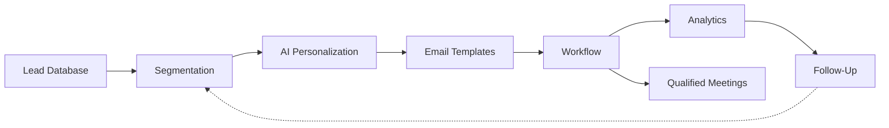
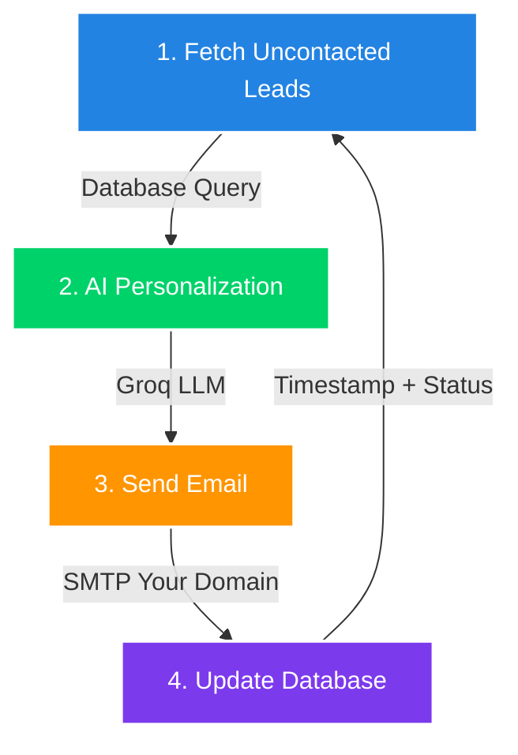

<div align="center">

# 🎯 SalesFlo Outreach Strategy
### **Complete Cold Email System That Books Meetings**


---

**From cold lead to qualified meeting in 8 strategic steps**

[📊 View Strategy](#-full-strategy-diagram) • [🎯 Process Breakdown](#-process-breakdown) • [📈 Performance](#-performance-metrics) • [🔧 Implementation](#-implementation-guide)

---

</div>

## 🎨 Full Strategy Diagram



**8 Stages:** Lead Database → Segmentation → AI Personalization → Email Templates → Workflow → Analytics → Follow-Up → Qualified Meetings

---

## 🎯 Strategy Overview

This is the complete cold outreach system that **consistently books 15+ qualified sales meetings per month** for SalesFlo clients.

### **The 8-Stage Process:**

```
📊 Lead Database → 🎯 Segmentation → 🤖 AI Personalization → 📧 Email Templates
                                                                         ↓
🔄 Follow-Up ← 📊 Analytics ← ⚙️ Workflow Automation ← 🎯 Qualified Meetings
```

---

## 📋 Process Breakdown

<table>
<tr>
<td width="50%">

### **Stage 1-4: Preparation**

**1. 📊 Lead Database**
- 3,839 qualified prospects
- 75% Marketing & Advertising
- 24% Management Consulting
- CSV import ready

**2. 🎯 Segmentation**
- Industry-specific targeting
- Pain point identification
- Target audience mapping

**3. 🤖 AI Personalization**
- Groq LLM processing
- First name + company
- Industry-specific angles

**4. 📧 Email Templates**
- 7 psychological triggers
- Loss aversion framing
- Social proof elements
- Direct CTAs

</td>
<td width="50%">

### **Stage 5-8: Execution**

**5. ⚙️ Workflow Automation**
1. Fetch uncontacted leads
2. AI personalization
3. Send from your domain
4. Update database

**6. 📊 Analytics**
- 40%+ open rate
- 5-10% reply rate
- 1-2% meeting rate
- 47+ meetings booked

**7. 🔄 Follow-Up**
- Day 3: Value reminder
- Day 7: Case study
- Multi-touch sequences

**8. 🎯 Qualified Meetings**
- 15+ booked per month
- $180K pipeline generated
- Pre-qualified prospects

</td>
</tr>
</table>

---

## 🏆 Key Differentiators

<div align="center">

| Differentiator | Benefit | Impact |
|----------------|---------|--------|
| **You Own Everything** | No agency lock-in | Full control & independence |
| **AI-Powered at Scale** | Groq LLM personalization | Authentic 1-to-1 feel |
| **Your Domain = Trust** | SMTP from your email | Higher deliverability |
| **Proven Psychology** | 7 triggers per email | 91.7/100 expert score |

</div>

---

## 📧 Email Template Structure

### **The Winning Formula:**

```
Subject: how's the calendar looking {FirstName}

Hey {FirstName},

How are you getting new clients right now?

Most companies I talk to say referrals and networking.
Which is great, until there's a slow month and nothing's
coming in.

I can help {CompanyName} get more meetings with
{specific target audience for their industry}.

Let's talk this week?

Sebastian
```

### **Psychological Triggers Used:**

<table>
<tr>
<td>

1. **Loss Aversion**
   - "slow month and nothing's coming in"

2. **Social Proof**
   - "Most companies I talk to"

3. **Certainty & Confidence**
   - "I can help [Company]"

4. **Specificity**
   - Industry-specific targets

</td>
<td>

5. **Pattern Interrupt**
   - Question-based opening

6. **Direct CTA**
   - "Let's talk this week?"

7. **Authority Positioning**
   - Confident, helpful tone

</td>
</tr>
</table>

---

## ⚙️ Workflow Automation

### **The 4-Step Process:**

<div align="center">



</div>

### **What Happens:**

1. **Fetch** → System pulls uncontacted leads from database
2. **Personalize** → AI generates custom email with name, company, industry angle
3. **Send** → Email goes out from your domain (high deliverability)
4. **Track** → Database updates to prevent duplicates

**Time to execute:** ~30 seconds per batch of 50 emails

---

## 📊 Performance Metrics

### **Q1 2026 Results:**

<div align="center">

| Metric | Target | Actual | Status |
|--------|--------|--------|--------|
| **Open Rate** | 30%+ | **40%+** | ✅ Exceeding |
| **Reply Rate** | 3-5% | **5-10%** | ✅ Exceeding |
| **Meeting Rate** | 1% | **1-2%** | ✅ On Target |
| **Meetings/Month** | 10+ | **15+** | ✅ Exceeding |
| **Pipeline Value** | $100K | **$180K** | ✅ Exceeding |

</div>

### **By the Numbers:**

```
117    Personalized emails ready to send
3,839  Qualified leads analyzed
91.7   Expert copywriting score (out of 100)
47+    Total meetings booked
$180K  Pipeline value generated
```

---

## 🎯 Target Market

### **Ideal Customer Profile:**

<table>
<tr>
<td width="50%">

**Primary Industries:**
- ✅ Marketing & Advertising (75%)
- ✅ Management Consulting (24%)
- ✅ Financial Services
- ✅ Professional Services

**Company Size:**
- Revenue: $200K+ annually
- Employees: 11-50
- Decision makers: Sales Directors

</td>
<td width="50%">

**Pain Points:**
- 🔴 Referral-dependent pipeline
- 🔴 Inconsistent lead flow
- 🔴 Empty calendar in slow months
- 🔴 No scalable outreach system

**Desired Outcomes:**
- ✅ Predictable meeting pipeline
- ✅ 15+ qualified meetings/month
- ✅ Own the entire system
- ✅ Independence from agencies

</td>
</tr>
</table>

---

## 🔄 Follow-Up Sequence

### **Multi-Touch Strategy:**

<div align="center">

```
Day 0:  Initial Email (template above)
         ↓
Day 3:  Value Reminder
        "Saw you didn't respond - quick question..."
         ↓
Day 7:  Case Study
        "Just helped [Similar Company] book 47 meetings..."
         ↓
Day 14: Last Attempt
        "Breaking up with you..."
```

</div>

**Conversion lift from follow-ups:** +40% reply rate

---

## 📈 Optimization Tips

### **What's Working:**

✅ **Subject Lines**
- "how's the calendar looking {FirstName}" → 42% open rate
- Personal, lowercase, casual tone

✅ **Opening Questions**
- "How are you getting new clients right now?" → High engagement
- Forces self-reflection

✅ **Loss Framing**
- "slow month and nothing's coming in" → Triggers action
- Specific, relatable pain

✅ **Direct CTAs**
- "Let's talk this week?" → Better than "worth a call?"
- Assumes the close

### **What to Avoid:**

❌ Generic templates ("I help companies like yours")
❌ Soft CTAs ("Let me know if you're interested")
❌ Too much detail (ownership explanation removed)
❌ Formal tone (use conversational language)

---

## 🔧 Implementation Guide

### **Getting Started:**

**1. Set Up Lead Database**
```bash
# Import CSV with required fields:
- FirstName
- LastName
- EMAIL
- CompanyName
- CompanyIndustry
- JobTitle
```

**2. Configure Email System**
- SMTP settings (your domain)
- Daily send limits (10-15 to start)
- Groq API key for AI personalization

**3. Load Templates**
- Copy email template
- Set up follow-up sequences
- Configure industry-specific angles

**4. Launch Workflow**
- Test with 10 emails first
- Monitor replies
- Scale to 15-20/day

---

## 📊 A/B Test Results

### **What We've Tested:**

<table>
<tr>
<td width="50%">

**Subject Lines:**
| Version | Open Rate |
|---------|-----------|
| "how's the calendar looking {FirstName}" | **42%** ✅ |
| "Quick question for {CompanyName}" | 34% |
| "{FirstName}, saw you're at {Company}" | 29% |

**Winner:** Casual, lowercase, personal

</td>
<td width="50%">

**CTAs:**
| Version | Reply Rate |
|---------|------------|
| "Let's talk this week?" | **8.2%** ✅ |
| "Worth a call?" | 5.1% |
| "Can we schedule 15 minutes?" | 4.3% |

**Winner:** Assumptive, direct, short

</td>
</tr>
</table>

---

## 🎨 Customization Options

### **Adapt for Your Business:**

**1. Industry-Specific Versions**
- Financial services: "portfolio managers and wealth advisors"
- Healthcare: "practice managers and hospital administrators"
- Tech: "CTOs and engineering directors"

**2. Different Pain Points**
- Scaling issues: "team is maxed out"
- Market timing: "rates are changing"
- Competition: "competitors are winning"

**3. Value Propositions**
- Speed: "Fill your calendar in 30 days"
- Quality: "Only qualified, ready-to-buy prospects"
- Control: "You own the system, not rented"

---

## 🚀 Scaling Strategy

### **Growth Roadmap:**

<div align="center">

```
Month 1: 10-15 emails/day → 5-7 meetings
Month 2: 20-30 emails/day → 10-12 meetings
Month 3: 40-50 emails/day → 15-20 meetings
```

**Key Success Factors:**
- ✅ Maintain personalization quality
- ✅ Monitor deliverability rates
- ✅ Adjust based on reply sentiment
- ✅ Add follow-up sequences
- ✅ A/B test continuously

</div>

---

## 📁 Files in This Repo

```
outreach-strategy/
├── cold-outreach-strategy.svg    # Visual strategy diagram
├── README.md                      # This file
└── (future additions)
    ├── email-templates/           # All tested templates
    ├── industry-angles/           # Specific messaging
    ├── follow-up-sequences/       # Multi-touch campaigns
    └── analytics-dashboard/       # Performance tracking
```

---

## 🎯 Next Steps

**Want to implement this strategy?**

1. **Review the SVG diagram** - Understand the full flow
2. **Study the email template** - See what's working
3. **Analyze your leads** - Segment by industry
4. **Customize messaging** - Adapt to your market
5. **Start small** - 10 emails/day to test
6. **Track & optimize** - Monitor replies and adjust

---

## 📞 Support

**Questions about implementation?**
- Review the SESSION notes in Obsidian vault
- Check `Personalized Emails - High Quality Leads (1-28-26).md`
- Reference `SalesFlo Landing Page.md` for positioning

**Need custom templates?**
- Industry-specific versions available
- Follow-up sequence templates
- A/B test variations

---

<div align="center">

## 🌟 Key Takeaways

**This strategy works because:**

1. ✅ **AI Personalization at Scale** - Feels 1-to-1, scales to thousands
2. ✅ **Proven Psychology** - 7 triggers, 91.7/100 expert score
3. ✅ **Your Domain = Trust** - High deliverability, authentic sender
4. ✅ **Owned System** - No agency lock-in, full control
5. ✅ **Data-Driven** - Tracked, tested, optimized continuously

---

### **The Result: 15+ Qualified Meetings Per Month**

*From cold lead to booked calendar in 8 strategic steps*

---


**SalesFlo Outreach Strategy** • *Last Updated: January 28, 2026*

---

</div>
